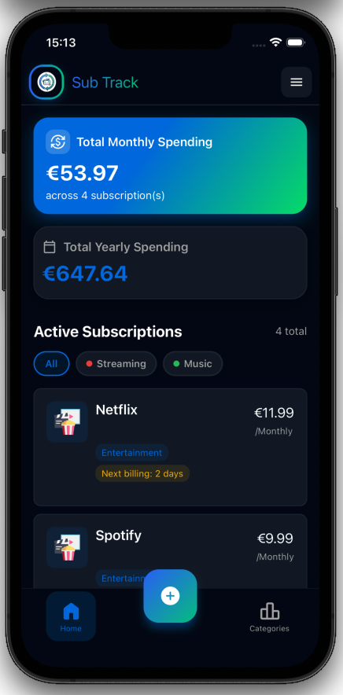
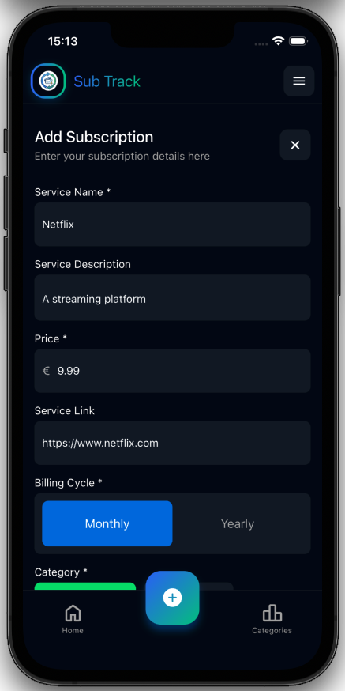
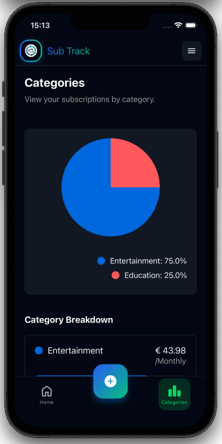

# Sub Track 💸

> **Take back control of your expenses. Never pay for an unwanted renewal again.**


## 📋 About The Project

**Sub Track** is a clean, simple, and privacy-focused subscription manager built with **React Native** and **Expo**. It helps users keep track of recurring payments like Netflix, Spotify, gym memberships, and software licenses.

In a world full of micro-transactions, it's easy to lose track of where your money goes. Sub Track calculates your total monthly and annual expenses and sends **local notifications** before an automatic payment is charged. This gives users the crucial time needed to decide whether to keep a service or cancel it before the renewal hits.

### 🌟 Key Features

* **📊 Expense Dashboard:** Get a crystal-clear overview of your fixed costs. Instantly view your total monthly and annual spending cap.
* **🔔 Smart Expiration Alerts:** Receive customizable local push notifications (e.g., 1 day before renewal) so you never get charged unexpectedly.
* **🏷️ Labels:** Create and assign custom color-coded labels to your subscriptions for flexible, personalized organization beyond standard categories.
* **wm Categories:** Organize your subscriptions by type (Entertainment, Work, Home, Utilities) to see exactly which area of your life costs the most.
* **🔒 Privacy First (Local Storage):** Your financial data is yours alone. Sub Track uses **AsyncStorage** to keep all data locally on your device. No external servers, no cloud tracking.

---

## 📥 Download

<p align="center">
  <a href="https://github.com/PellegrinoPiccolo/SubTrack/releases/latest/subtrack.apk">
    
  </a>
</p>

> **Note:** On Android, you may need to enable *Install from unknown sources* in your device settings before installing the APK.

---

## 📱 Screenshots

| Dashboard | Add Subscription | Categories |
|:---:|:---:|:---:|
|  |  |  |

*(Note: Screenshots are stored in the `screenshots/` folder to keep the app bundle light)*

---

## 🛠️ Tech Stack

This project was built using the following technologies:

* **Framework:** [React Native](https://reactnative.dev/)
* **Tooling:** [Expo](https://expo.dev/)
* **Language:** JavaScript / TypeScript
* **Data Persistence:** [AsyncStorage](https://react-native-async-storage.github.io/async-storage/) (Local Key-Value Storage)
* **Notifications:** Expo Notifications

---

## 🚀 Getting Started

To get a local copy up and running, follow these simple steps.

### Prerequisites

* **Node.js** and **npm** installed.
* **Expo Go** app installed on your iOS or Android device (or an Emulator).

### Installation

1.  Clone the repo
    ```sh
    git clone https://github.com/PellegrinoPiccolo/sub_track.git
    cd sub-track
    ```
2.  Install dependencies
    ```sh
    npm install
    ```
3.  Start the app
    ```sh
    npx expo start
    ```
4.  Scan the QR code appearing in your terminal with the **Expo Go** app (Android) or the Camera app (iOS).

---

## 🛡️ Privacy Policy

Sub Track is designed with privacy as a core principle.
* We do not track user activity.
* We do not store data on external servers.
* All data is stored locally using `AsyncStorage` and stays on the user's device.

---

## 🤝 Contributing

Contributions are welcome for **educational and personal use improvements**.

1.  Fork the Project
2.  Create your Feature Branch (`git checkout -b feature/AmazingFeature`)
3.  Commit your Changes (`git commit -m 'Add some AmazingFeature'`)
4.  Push to the Branch (`git push origin feature/AmazingFeature`)
5.  Open a Pull Request

---

## 📄 License

Distributed under the **Creative Commons Attribution-NonCommercial-ShareAlike 4.0 International License (CC BY-NC-SA 4.0)**.

This means:
* ✅ **You CAN** use, copy, and modify this software for personal or educational purposes.
* ❌ **You CANNOT** use this software for commercial purposes (selling it, including it in paid products, or using it for business gain) without prior permission.
* 🔄 **ShareAlike:** If you modify this code, you must distribute it under the same license.

See the `LICENSE` file for the full legal text.

---

## 📞 Contact

Pellegrino Piccolo - pellegrinopiccolo22@gmail.com

Project Link: [https://github.com/PellegrinoPiccolo/sub_track](https://github.com/PellegrinoPiccolo/sub_track)
